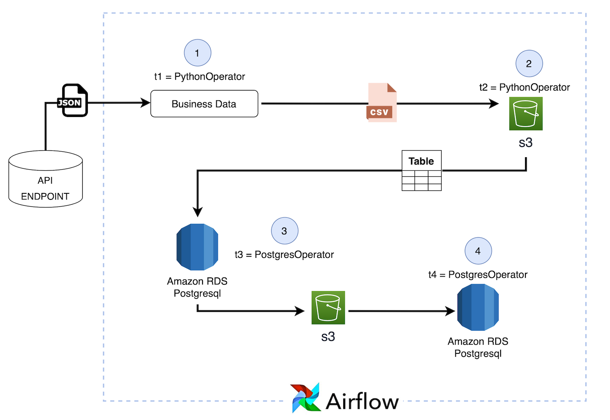

# Overview

The purpose of this project is to show how to use Airflow to take JSON data from an API endpoint and insert it into a Postgres database.

## How it works

## Built With

* Postgres - Database
* Airflow
* Python
* S3
* EC2
